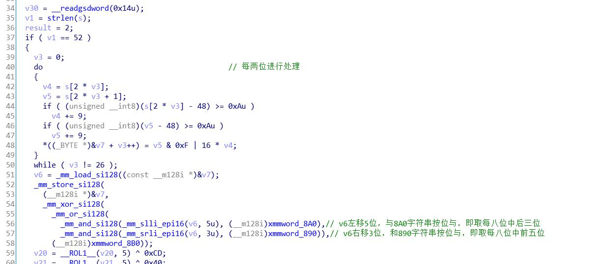
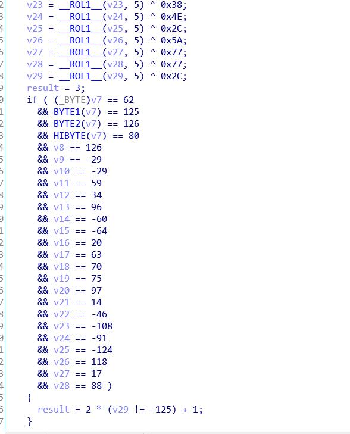
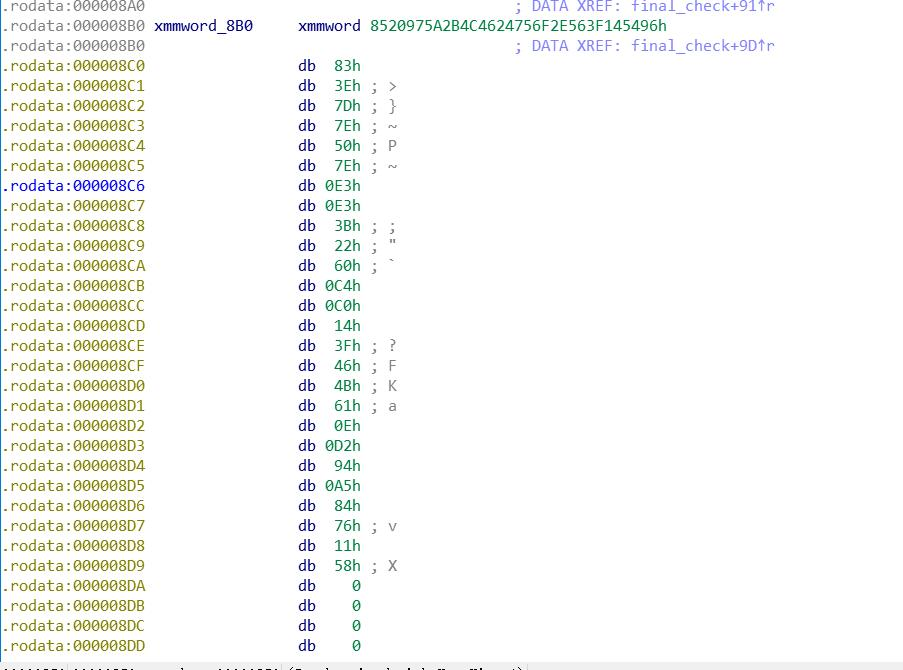

##  Title
ReverseMe

##  Tools
IDA Pro

##  Steps

- Step 1

dex文件反编译失败，看题目描述大概是修改了文件头，不太会修，直接去逆so库了

- Step 2

首先是check函数，没什么有用的东西，只是调用了final_check

- Step 3

finalcheck第一步和第二步在图中有注释，不再说明

然后就是一个异或

解密思路就是先异或，然后取结果每8位的前五位和后三位，调整顺序，就是flag