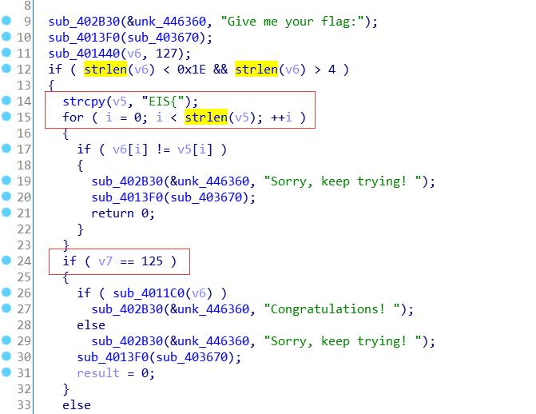

##  Title
IgniteMe

##  Tools
IDA Pro

##  Steps

- Step 1
首先检测flag的格式和长度，即EIS{}，这里长度是一个范围 4<长度<0x1E


- Step 2
然后进入4011C0，首先是大小写互换，然后是两次异或


解密脚本:

```c
#include <iostream>
using namespace std;


int main()
{
	int key[32] = { 0x0D, 0x13, 0x17, 0x11, 0x02, 0x01, 0x20, 0x1D, 0x0C, 0x02, 0x19, 0x2F, 0x17, 0x2B, 0x24, 0x1F, 0x1E, 0x16, 0x09, 0x0F, 0x15, 0x27, 0x13, 0x26, 0x0A, 0x2F, 0x1E, 0x1A, 0x2D, 0x0C, 0x22, 0x04 };
	int tmp;
	char *c_txt = "GONDPHyGjPEKruv{{pj]X@rF";
	for (int i = 0; i < 24; i++) {
		tmp = ((c_txt[i] ^ key[i]) - 72) ^ 0x55;
		cout << (char)tmp;
	}
    return 0;
}
```