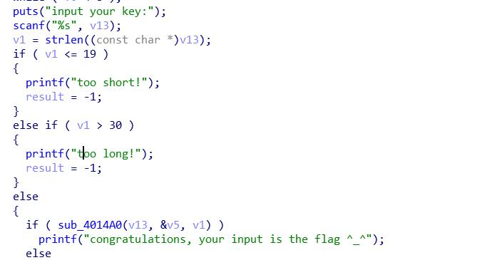
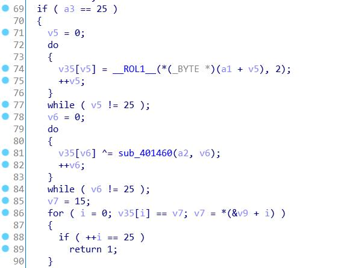

##  Title
ReverseMe

##  Tools
IDA Pro

##  Steps

- Step 1

首先是长度检验 19<长度<30


- Step 2
然后是一个循环左移2位和一个异或


解密脚本:

```
key= [26, 162, 47, 249, 148, 67, 60, 196, 77, 216, 140, 197, 91, 182, 110, 234, 163, 60, 201, 155, 188, 202, 173, 215, 126, 224]
c_txt = [0x0F, 0x87, 0x62, 0x14, 0x01, 0xC6, 0xF0, 0x21, 0x30, 0x11, 0x50, 0xD0, 0x82, 0x23, 0xAE, 0x23, 0xEE, 0xA9, 0xB4, 0x52, 0x78, 0x57, 0x0C, 0x86, 0x8B, 0x00, 0x00, 0x00, 0x00, 0x00]

s=""
for i in range(0, 26):
	x = key[i] ^ c_txt[i]
	y = ((x<<(8 - 2) ) | (x>>2))%256
	print x, y
	s+=chr(y)
print s
```

这里的key是用401460函数中的算法生成的