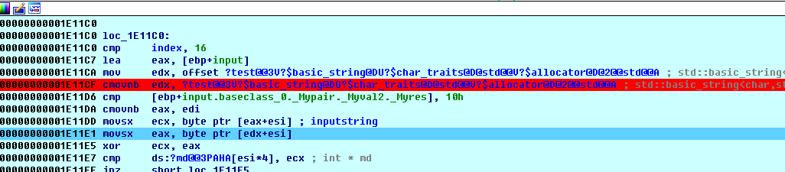

## **Title** 
 b1nary

## **Steps** 
.exe文件逆向分析

首先打开，发现似乎不能IDA F5大法，于是直接查看代码逻辑:



关键的逻辑就是这段，将input和edx为基址的变量进行亦或，如果xor不为0的话，那么会比较esi中的值


如果不相等的话会输出"Well down!"，否则的话输出failed
于是思路就是将两个地址中的数据想亦或，就能得到答案:


这里提一下，由于是C++中的string类型，所以会在程序开始的时候才进行初始化，也就是说，上述的地址只有在动态调试的时候才能够见的到。
最后写一个简单的脚本:

```
t1 = "Mht!^okHGfdCbn!@4t>"
t2 = [26,13,85,98,17,2,88,23,117,57,42,54,86,15,66,52,82,69]
for i,j in zip(t1,t2):
    print(chr(ord(i)^j),end = '')

# We!COm3_2_Nu4actf1
```
