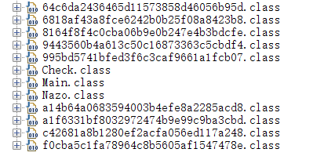
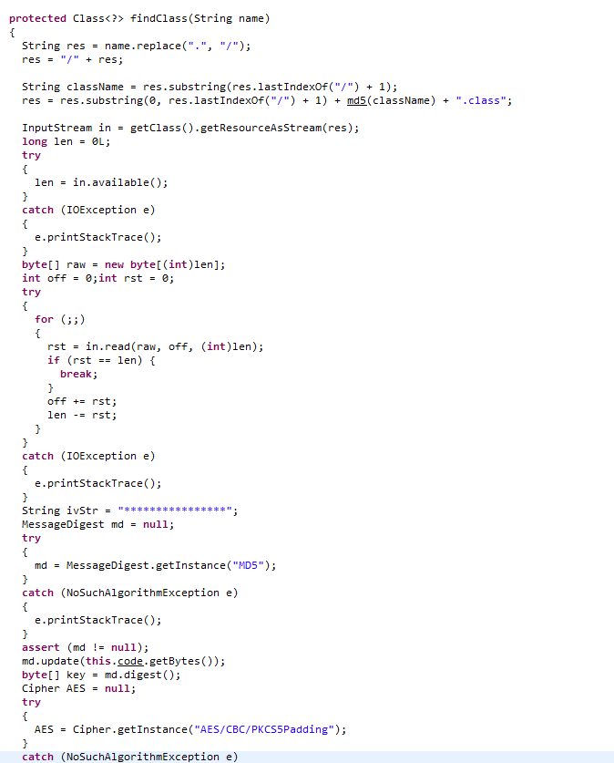

##**Topic**
nuaactf

##**Steps**
.jar 文件反编译, 爆破

这个程序是一个jar文件，要用java环境才能运行。初步运行之后逻辑如下:


发现是要我们输入一个字符串作为key。然后我们使用jd-gui观察一下逻辑:



发现里面把一个叫做Nazo的类叫做encode，作为加密函数，我们看到加密函数本身非常复杂，但是有几处奇怪的数字:

```
int a = 1732584193;
int b = -271733879;
int c = -1732584194;
int d = 271733878;
int e = -1009589776;
```

这些数字是用来做什么的呢？百度一下之后能够发现，这些数字都是SHA1加密的时候用到的数字，然后最后有一个逻辑便是将这个SHA1映射后的数据进行比较的逻辑。那么此时我们先猜测这个数据是啥:

```java
 if (in.length() != 4) {
      throw new Exception("INCORRECT KEY");
    }
```

这里可以看出，输入字符串的长度为4，那么我们进行爆破:

```
import hashlib, string

def findSha1():
    for i in string.printable:
        for j in string.printable:
            for k in string.printable:
                for l in string.printable:
                    if hashlib.sha1((i+j+k+l).encode('utf-8')).hexdigest() == "caf4cbafdf72ce0f2f2eadc4309916e8c96f0de8":
                        print(i+j+k+l)
                        return i+j+k+l

        print(i+j+k+l)

if __name__ == '__main__':
    print("find key {}".format(findSha1()))

```

得到key为mdzz。。。好吧，然后我们继续查看逻辑:

```java
if (Check.checkPassword(password))
{
  a = a14b64a0683594003b4efe8a2285acd8.getInstance();
  a.code = t;
  Object clazz = a.loadClass("com.company.Stage");
  Method c = ((Class)clazz).getMethod("Start", new Class[] { new String().getClass() });
  c.invoke(((Class)clazz).newInstance(), new Object[] { t });
}
```
这一段是java的载入过程的调用，就相当于是手动读入一个java的class，然后去调用这个class。然后我们跟入这个看起来很奇怪的类里面，发现里面重载了findClass这个函数:



从这个函数的大致内容可以看出来，过程就是:

 * 将我们传入参数中的最后一个类的名字，也就是当前类的名字取出来
 * 将这个名字md5处理一下，然后重新形成新的包的名字
 * 接下来将当前的包读入，进行AES解密，其中iv为"****************"，key为我们之前爆破的内容。
 * 最后将类返回

既然知道了逻辑，我们就将当前的所有.class解密一下
(仅为参考代码)

```java
import javax.crypto.BadPaddingException;
import javax.crypto.Cipher;
import javax.crypto.IllegalBlockSizeException;
import javax.crypto.NoSuchPaddingException;
import javax.crypto.spec.IvParameterSpec;
import javax.crypto.spec.SecretKeySpec;
import java.io.*;
import java.security.InvalidAlgorithmParameterException;
import java.security.InvalidKeyException;
import java.security.MessageDigest;
import java.security.NoSuchAlgorithmException;

/**
 * Created by link on 2017/10/1.
 */
public class Decode {
    private static String code = "mdzz";

    public static String md5(String string)
    {
        if (string.isEmpty()) {
            return "";
        }
        MessageDigest md5 = null;
        try
        {
            md5 = MessageDigest.getInstance("MD5");
            byte[] bytes = md5.digest(string.getBytes());
            String result = "";
            for (byte b : bytes)
            {
                String temp = Integer.toHexString(b & 0xFF);
                if (temp.length() == 1) {
                    temp = "0" + temp;
                }
                result = result + temp;
            }
            return result;
        }
        catch (NoSuchAlgorithmException e)
        {
            e.printStackTrace();
        }
        return "";
    }

    public static void decodeClass(String name)
    {
        // File file = new File(name);
        InputStream in = null;
        FileOutputStream out = null;
        try {
            in = new FileInputStream(name);
            out = new FileOutputStream(name + "_decode.class");
        } catch (FileNotFoundException e) {
            e.printStackTrace();
        }
        long len = 0L;
        try
        {
            len = in.available();
        }
        catch (IOException e)
        {
            e.printStackTrace();
        }
        byte[] raw = new byte[(int)len];
        int off = 0;int rst = 0;
        try
        {
            for (;;)
            {
                rst = in.read(raw, off, (int)len);
                if (rst == len) {
                    break;
                }
                off += rst;
                len -= rst;
            }
        }
        catch (IOException e)
        {
            e.printStackTrace();
        }
        String ivStr = "****************";
        MessageDigest md = null;
        try
        {
            md = MessageDigest.getInstance("MD5");
        }
        catch (NoSuchAlgorithmException e)
        {
            e.printStackTrace();
        }
        assert (md != null);
        md.update(code.getBytes());
        byte[] key = md.digest();
        Cipher AES = null;
        try
        {
            AES = Cipher.getInstance("AES/CBC/PKCS5Padding");
        }
        catch (NoSuchAlgorithmException e)
        {
            e.printStackTrace();
        }
        catch (NoSuchPaddingException e)
        {
            e.printStackTrace();
        }
        SecretKeySpec spec = new SecretKeySpec(key, "AES");
        IvParameterSpec iv = new IvParameterSpec(ivStr.getBytes());
        try
        {
            assert (AES != null);
            AES.init(2, spec, iv);
        }
        catch (InvalidAlgorithmParameterException e)
        {
            e.printStackTrace();
        }
        catch (InvalidKeyException e)
        {
            e.printStackTrace();
        }
        byte[] en = null;
        try
        {
            en = AES.doFinal(raw);
        }
        catch (BadPaddingException e)
        {
            e.printStackTrace();
        }
        catch (IllegalBlockSizeException e) {
            e.printStackTrace();
        }
        try {
            out.write(en);
            out.close();
        } catch (IOException e) {
            e.printStackTrace();
        }

    }
    public static void main(String argv[]){
        String filename = FilePath;
        for(int i = 2; i <= 8; i++){
            decodeClass(filename + md5(String.format("Stage%d", i)) + ".class");
        }
        return ;
    }
}
```

解密之后，重新查看各个类。可以看到，首先是进入了Stage.class里面查看函数:

```java
  try
    {
      clazz = this.step.loadClass("com.company.Stage2");
    }
    catch (ClassNotFoundException e)
    {
      e.printStackTrace();
    }
    Method c = null;
    byte[] ans = { 0, 0, 0, 0, 0, 0, 0, 0, 0, 0, 0, 0, 0, 0, 0, 0, 0, 0 };
        try
    {
      c = clazz.getMethod("check", new Class[] { new byte[0].getClass() });
    }
    catch (NoSuchMethodException e)
    {
      e.printStackTrace();
    }
    try
    {
      ans = (byte[])c.invoke(null, new Object[] { flag.getBytes() });
    }

```

看到这里调用了Stage2类,并且再后面调用了check函数，我们继续跟踪,然后发现大概内容和Stage一样，只不过这一次调用了Stage5，并且有函数:

```java
    for (int i = 0; i < flag.length; i++) {
      if (i % 3 == 0) {
        flag[i] = ((byte)(flag[i] ^ 0x6));
      }
    }
```

这里把%3 == 0的下标对用的数据都进行了^0x6
Stage5中调用了Stage7，其中的加密逻辑则是如下:

```java
    for (int i = 0; i < flag.length; i++) {
      if ((i + 2) % 3 == 0) {
        flag[i] = ((byte)(flag[i] ^ 0x33));
      }
    }
```
Stage7中却没有任何加密，直接返回了flag。

Stage类最后还有一段比较内容:

```java
byte[] checkflag = { 100, 106, 55, 53, 80, 48, 66, 0, 95, 81, 2, 55, 110, 108, 67, 54, 119, 51 };
    for (int i = 0; i < checkflag.length; i++) {
      if (checkflag[i] != ans[i])
      {
        System.out.println("Oh, what a pity~");
        return;
      }
    }
    System.out.printf("Congratulation! flag is nuaactf{%s}", new Object[] { flag });
  }
```

那么显然我们的的flag已经呼之欲出了:

```python
for i,j in enumerate( checkflag):
    if i %3 == 0:
        print(chr(checkflag[i]^0x6),end = '')
    elif (i+2) % 3 == 0:
        print(chr(checkflag[i]^0x33),end ='')
    else:
        print(chr(checkflag[i]),end ='')

```

得到flag为：

```
bY73c0D3_W17h_C0D3
```
