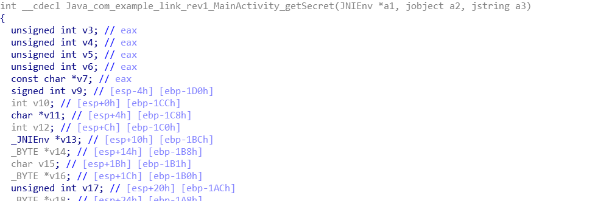

## **Topic**
robots

## **Steps** 
app逆向分析，elf文件逆向分析，数据库文件查看

发现是一个app，下载下来看一看:


看到是一个输入框，然后如果随便输入的话，会显示

```
Ennnnnn........No.Right...
```

我们拿出jeb进行简单的分析，找到里面一个关键的逻辑:

```java
public void onClick(View arg4) {
        if(this.c.check(this.getSecret(this.userEdit.getText().toString()), ((Context)this))) {
            this.tv.setText("Well done!");
        }
        else {
            this.tv.setText("Ennnnnn........No.Right...");
        }
    }
```

这里的调用过程调用了一个叫做c.check的方法，顺着找进去

```java
 CheckAns() {
        super();
        this.name = "aGVsbG8=";
    }

    public boolean check(String arg9, Context arg10) {
        boolean v5 = false;
        Cursor v0 = new SQLAm().openDatabase(arg10).rawQuery("SELECT * FROM user1 WHERE name=\'" + CheckAns.md5(new String(Base64.decode(this.name, 0))) + "\'", null);
        v0.moveToNext();
        String v4 = v0.getString(v0.getColumnIndex("secret"));
        if(arg9.length() == 20 && (v4.equals(arg9))) {
            v5 = true;
        }

        return v5;
    }
```

大致就是说用打开了一个sqlite的数据库，并且再其中取出了当前name的md5值对应的那个数据。
我们可以看到，name是一个base64编码过的数据，然后将其解码后md5，得到的数值为:

```
5d41402abc4b2a76b9719d911017c592
```

然后我们解开当前的apk，可以看到里面再asset里面有一个叫做test的文件，其即为我们的数据库。我们打开数据库，能够看到里面的数据为:

然后取出我们查找的字符串:

```
kEvKc|roAkNADgGExUeq
```

这个长的也不像flag啊。。然而可以注意到，再一开始的时候，我们再取得字符串之前有一个getSecret的函数，这个函数在哪里呢？

```java
public native String getSecret(String arg1) {
}
```

也就是说，这个函数是写在.so文件中的，我们找到其中一个.so文件，反编译一下:



找到这个函数之后，理清楚一下逻辑:
程序里面存开始就放了要给字符串数组:


接下来分析逻辑
首先我们会往dest数组中存入数组下标
[0-0x44]
然后会把当前的数组的数字向后循环移动16

```
  for ( i = 0; ; ++i )
  {
    i_1 = i;
    v3 = getLength(&static_ptr);
    if ( i_1 >= v3 )
      break;
    v27 = dest[i] + 16;
    v26 = getLength(&static_ptr);
    dest[i] = v27 % v26;
  }
```

接下来的逻辑可以理解成：
将当前的inputstr和之前存入的static_str作比较，如果相等的话，使用dest数组中映射过的下标替换当前的字符串。
最后还有一段加密的逻辑：

```
  for ( l = 0; ; ++l )
  {
    v17 = l;
    v6 = getLength(&input_ptr);
    if ( v17 >= v6 )
      break;
    v16 = (_BYTE *)getChar(&input_ptr, l);
    v15 = (char)(l ^ *v16) % -128;
    v14 = (_BYTE *)getChar(&input_ptr, l);
    *v14 = v15;
  }
```

替换过的字符串还要和当前下标异或，得到的字母%128（不过一般是不会超过128的）。最后输入处理完之后要得到我们从数据库里面拿出来的字符串:`kEvKc|roAkNADgGExUeq`
那么我们剩下的操作大致就可以知道了:利用脚本将偏移后的字符串重新移位回去即可；

```python
static_str = '0123456789abcdefghijklmnopqrstuvwxyzABCDEFGHIJKLMNOPQRSTUVWXYZ!{|}~'
now = 'kEvKc|roAkNADgGExUeq'
for i,each in enumerate(now):
    tmp = chr(ord(each)^i%128)
    index = static_str.find(tmp)
    if index < 16:
        index = index + len(static_str)
    print(static_str[index-16],end ='')
```

得到答案为:

```
4ndr0id1s!ntr3st1ng!
```
