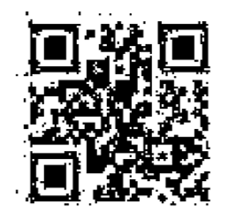

##  4433

##  Tools

- example
- example

##  Steps

- Step 1

`strings` 发现末尾奇怪字符串

```sh
6516204         {yR
6516341 3#[1
6516377 (sD}
6516424 <bo:2
6516451 x;{w
6516604 <0yB
6516620 =>> > >=>> > = > == >                           
6516742 pGg>
6517106 ^Fpx
6517374 A.Rw
6517454 mQ}j
```

`hexdump`观察后

```sh
001a9d90  3d 3e 3e 20 3e 20 3e 3d  3e 3e 20 3e 20 3d 20 3e  |=>> > >=>> > = >|
001a9da0  20 3d 3d 20 3e 20 20 20  20 20 20 20 20 20 20 20  | == >           |
001a9db0  20 20 20 20 20 20 20 20  20 20 20 20 20 20 20 20  |                |
```

- Step 2

据说长得像摩斯码,提取出来转一下得到`DELETEME`

删除这部分后得到完整的压缩包

- Step 3

用PS打开通过修改色阶或曲线等参数后即可发现图片中隐藏的二维码!




扫码得到`...--.----...--..`


- Step 4

这时想到压缩文件的文件名为44333，则有可能是密文分隔的提示，根据提示破解摩斯密码得到VYGUD，但这并不是最终的FLAG，由搜索引擎搜索摩斯密码可知摩斯密码常用的缩写中：VY代表VERY，GUD代表GOOD，则最终FLAG为VERYGOOD


