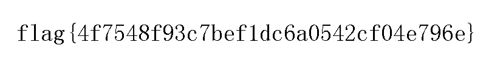

##  Title

##  Tools

##  Steps

- Step 1


字节翻转得到jpg文件

```python
#!/usr/bin/env python
# -*- coding: utf-8 -*-
# @Date    : 2017-10-08 11:35:26
# @Author  : Xu (you@example.org)
# @Link    : https://xuccc.github.io/
# @Version : $Id$

import os

with open('reverseMe','rb') as fp:
    data = fp.read()
    reverse = data[::-1]
    print reverse
```

- Step 2




